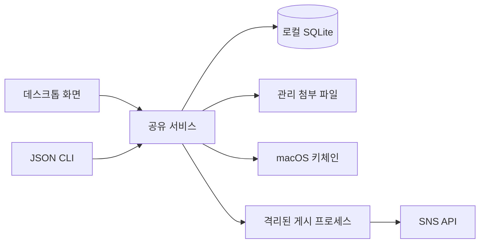

# 단일 데이터 설계

GUI와 CLI는 같은 `socialdesk.service.Service`를 호출한다. CLI의 일반 명령은 Qt를 가져오지 않는다. 앱이 실행 중이거나 로컬 서버가 떠 있어야 한다는 의존성이 없다. 배포 앱의 같은 실행 파일이 GUI 명령과 CLI 명령을 모두 처리한다.

SQLite WAL, `BEGIN IMMEDIATE`, 버전 조건부 수정, 작업별 고유 제약으로 프로세스 간 변경을 조정한다. GUI는 공유 리비전을 750ms마다 확인한다. 갱신 중 추가 변경이 발생해도 다음 주기에 읽도록 갱신 시작 시점의 리비전을 기록한다. 저장하지 않은 편집은 보존하며 충돌 시 사용자가 다시 불러올 수 있다.

게시 승인에는 게시물 버전을 기록한다. 문구·대상·첨부·계정 식별 정보나 인증 정보를 바꾸면 기존 승인을 해제한다. `(post_id, account_id, version)`은 고유 작업이며 worker 시작도 조건부 갱신으로 한 번만 획득한다. 완료한 작업은 기존 URL을 반환한다. 네트워크 실패나 프로세스 중단은 성공·실패를 추측하지 않고 실제 계정 확인을 요구한다.

SNS 어댑터는 격리된 프로세스에서 계정 하나의 키체인 인증만 사용한다. 갱신 토큰의 임시 파일은 제한된 임시 디렉터리에서 키체인으로 옮기고 삭제한다. 데이터베이스에는 키체인 참조 계정 ID와 인증 설정 여부만 저장한다. 인증 값과 SDK 응답 본문은 사용자 로그에 출력하지 않는다.

계정별 식별 정보와 게시 대상 ID를 구분한다. 여러 SNS 계정은 각자의 ID를 가지며 사용자가 게시물에 선택한 계정만 작업에 포함한다. 앱 실행 위치·스킬 설치 위치·소스 체크아웃 위치가 달라도 기본 데이터 경로는 동일하다.

검증은 모의 API·메모리 인증 저장소·임시 SQLite를 사용한다. 실제 SNS API나 실제 키체인 인증 항목을 검사·변경하지 않는다. 백업은 SQLite backup API로 WAL의 최신 커밋까지 복사한다. 첨부와 키체인은 별도 저장소이므로 데이터베이스 백업에 포함하지 않는다고 명시한다.
